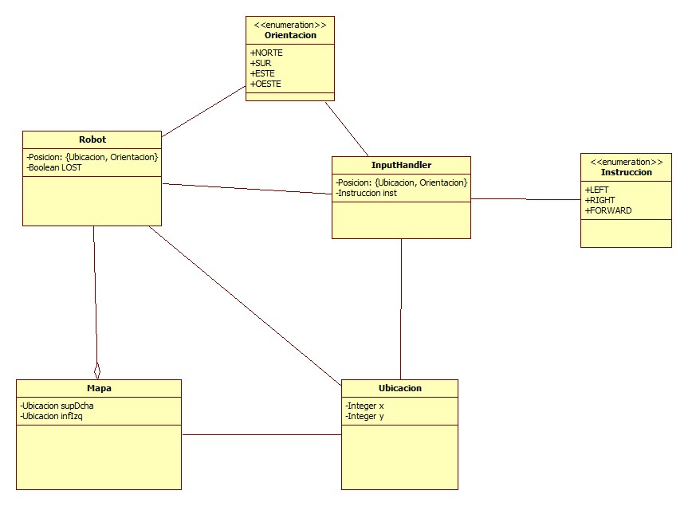
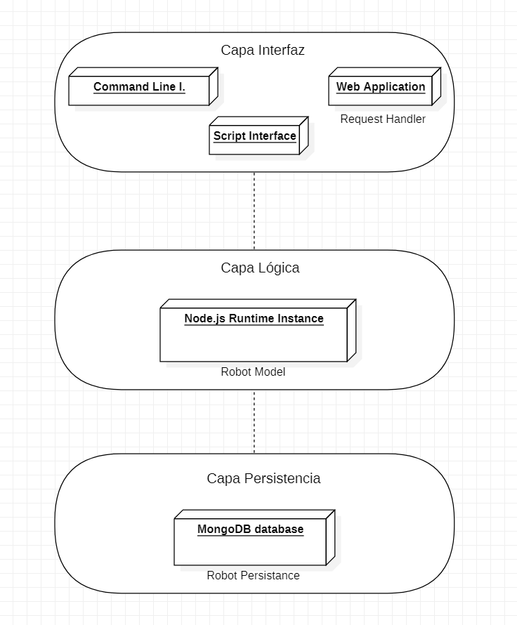
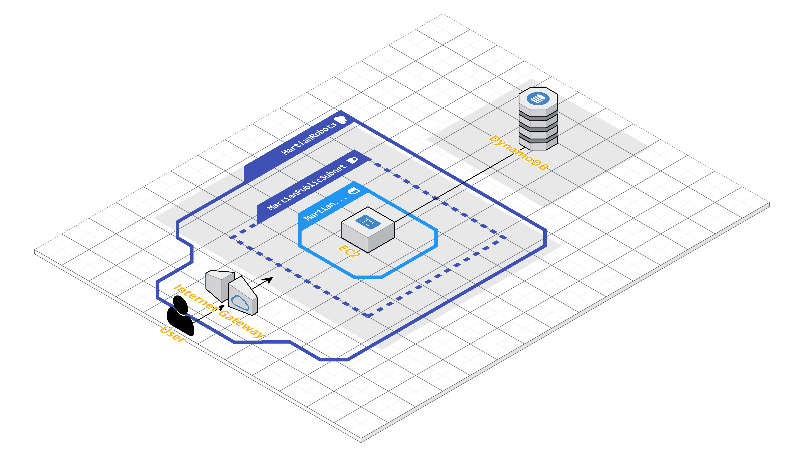
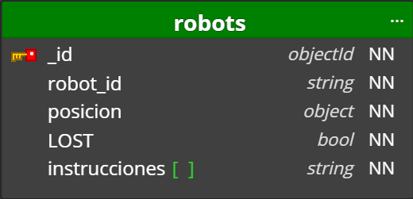
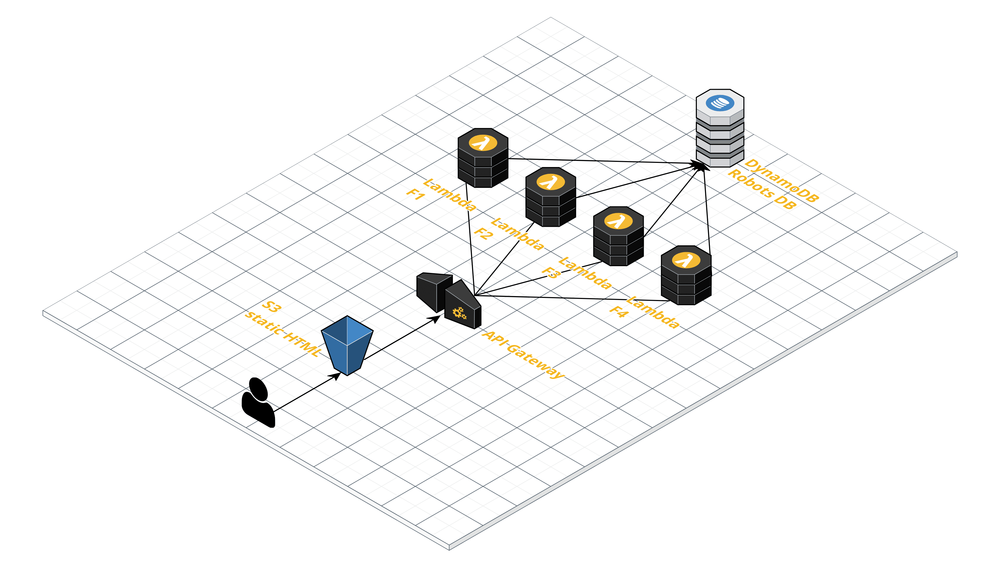

# Martian Robots 🪐

Este programa determina cada posición de los robots introducidos y su posición final.  
Se compone de dos partes principales:
- 1 - **[Proceso](#1-proceso-de-desarrollo-) de desarrollo**:

1. Especificación de requisitos y análisis.
2. Diseño de la arquitectura.
3. Aproximación de implementación con `Python` y CLI.
4. Migración a `Node.js`.
5. Implementación de la persistencia.
6. Desplegar REST API.
7. Contenerizar (`Docker`).
8. Deployment en nube (`AWS`).
9. Planteamiento de ejecución serverless.

- 2 - **[Instrucciones](#2-instrucciones-para-su-ejecucion-) para su ejecucion**

*-------------------------------------------------------------------------*

## *1. Proceso de desarrollo* 🧰

#### 1. Especificación de requisitos y análisis
##### **Casos de Uso:**

| Caso de Uso | Descripción |
| ------------- | ------------- |
| **CU-1:** Introducir coordenada sup-dcha  | El usuario puede introducir las coordenadas iniciales del "mapa" |
| **CU-2:** Introducir posición robot | El usuario puede fijar la posición para el robot con el formato (int x int y, 'orientacion') |
| **CU-3:** Introducir instrucción robot | El usuario puede determinar la instrucción para el robot |
| **CU-4:** Consultar robots | El usuario puede consultar los robots del sistema |
| **CU-4-ext:** Consultar robots perdidos | El usuario puede consultar los robots marcados con la etiqueta "LOST" |

##### **Reglas de Negocio:**

- RU-1: La posición de un robot consiste en una coordenada en el mapa(formato: x, y) y una orientación(norte, sur, este, oeste).
- RU-2: La instrucción para un robot consiste en una cadena de caracteres formado por las letras: “L”,”R”, “F”.
- RU-3: El mapa es rectangular y delimitado, con la coordenada inf.izq fijada a '0, 0'.
- RU-4: Un robot que se mueve fuera de los límites es “perdido” para siempre.
- RU-5: La posición de “LOST” de un robot implica que el resto de robots ya no pueden ser perdidos en esa posición.
- RU-6: El valor máximo de cualquier coordenada es 50.
- RU-7: Cualquier instrucción será de menos de 100 caracteres de longitud.
- RU-8: El “output” estará compuesto por la posición final del robot y su orientación. Si el robot se pierde se imprimirá por pantalla la palabra “LOST”.
- RU-9: El sistema debe ser extensible para que, en el caso de implementaciones adicionales, su incorporación no resulte costosa.

##### Diagrama de análisis:
 
Siguiendo los casos de uso y las principales reglas de diseño se modela el diagrama de clases.  
  

   

#### 2. Diseño de la arquitectura
##### Diagrama de disenyo:

Se elige una arquitectura con un modelo multicapa. En concreto, de tres capas:

- Interfaz
- Lógica o de negocio
- Persistencia

Además, se incluye un boceto de una implementación con AWS:
- Instancia `EC2` para el despliegue de la API REST con el servidor de `Node.js`.
- Instancia en `EC2` para el despliegue de la Base de Datos de `MongoDB`.

#### 3. Aproximación de implementación con `Python` y CLI.

Se realiza una implementación en python para contruir el esqueleto de la aplicación. Para su ejecución se hace uso de la interfaz de comandos de cualquier SO.  
En la sección de instrucciones se explica como [ejecutar](#1-ejecucion-en-python) esta aplicación.

#### 4. Migración a `Node.js`

La implementación realizada en python se pasa a JavaScript para ejecutarse en `Node.js`  
Se optimiza el diseño para adaptarse. Aspectos y características de Python tienen que ser "rediseñadas" para poder implementarse con JavaScript.  
Además, se escriben tests con Jest para comprobar el correcto funcionamiento.

#### 5. Implementación de la persistencia.

La persistencia se implementa mediante el uso de base de datos No-SQL orientada a documentos. En concreto, con MongoDB.

  
  
La BD es muy sencilla. Tan solo es necesaria una colección, donde se almacenan:
- Id del robot (generado en tiempo de ejecución con uuid).
- La posición (formada por los mismos parámetros que el código).
- Un valor booleano que determina si el robot se ha perdido.
- El set de instrucciones asociado a ese robot.

#### 6. Desplegar API REST

Con el objetivo de proveer una mayor interfaz de acceso y visualización de los datos, se implementa una API. Sin embargo, está en fase inicial; y solo permite la consulta de los robots existentes y los que están perdidos. El funcionamiento es explicado en la [sección](#2-ejecucion-de-la-segunda-version) de instrucciones de ejecución.  
Para crear una API de forma rápida se hace uso del framework `express`.  
Se implementan dos rutas:
- GET /robots --> devuelve todos los robots en la BD.
- GET /robots/lost --> devuelve los robots perdidos. 

#### 7. Contenerizar (`Docker`).

Una vez terminada la API, se contenerizan los servicios para una mayor comodidad de uso y despliegue. Para ello se usan dos contenedores:
- API REST container: se compila una imagen de contenedor con Dockerfile ==> `migue9b/martian-api:1.0`  
  🐳 https://hub.docker.com/r/migue9b/martian-api 🐳
- MongoDB database container: se usa la propia imagen de `mongo:5.0.3`

#### 8. Despliegue en nube `AWS`

Los contenedores se despliegan en nube. En concreto, en AWS. Cada contenedor se implementa en una instancia EC2(`Elastic Compute`); y cada instancia se lanza en una AZ(zona de disponibilidad de AWS) distinta.  
Están bajo la misma red, pero en subredes distintas. En el [diagrama](#diagrama-de-disenyo) de diseño se puede apreciar.

#### 9. Planteamiento serverless.

A continuación se plantea un modelo de arquitectura serverless. Es decir, sin necesidad de un servidor. En concreto, con una página HTML estática que tenga una serie de opciones; un "almacén" para ese HTML; y unas funciones lambda.  
  
 

**USER** --> **HTML** --> **API REQUEST** --> **LAMBDA FUNCTION** 

Cada una de las funciones se encargaría de procesar:
- Coordenadas de Mapa
- Posicion y orientación del robot
- Instrucciones
- GET robots

## 2. *Instrucciones para su ejecucion* ⬇

### 1. Ejecución de la primera `Release: v1.0`

Para ejecutar la primera versión de la aplicación simplemente se descarga el `.zip` de la release.  
Hay dos versiones:
- Python
- Node.js

#### 1. Ejecucion en python

En la carpeta `python` del proyecto:

        python3 app.py

#### 2. Ejecucion en Node

En la carpeta `node/src`

      node app.js

### 2. Ejecucion de la segunda version

Para la segunda versión se amplía la primera release con soporte API y persistencia.  
Es decir, la aplicación se compone de:
- "Núcleo" lógico: formado por la aplicación en la línea de comandos, que almacena  
la información necesaria de los robots.
- Interfaz de acceso de datos: conformado por la API REST, que proporciona la consulta  
de los robots.

Por lo tanto, el esquema de ejecución para esta versión final de la app sería:  

El usuario ejecuta e interactúa con la aplicación desde CLI. Por cada robot e instrucciones  
que introduce, éstas son almacenadas en la BD.  
Si el usuario quisiera ver información acerca de los robots o filtrar los robots perdidos,  
puede hacer uso de la API. Es importante destacar que el registro de las posiciones de  
los robots perdidos(que sirve para evitar la pérdida de los demás robots en esa posición)  
se realiza en tiempo de ejecución. Por tanto, si, históricamente ya hay un robot perdido  
en la BD; cuando se interaccione con la app, esa posición no será tomada en cuenta.  
En resumen, la aplicación no precarga ningún dato de la BD.  

Hay dos opciones para "usar" la app:

#### 1. Ejecucion con despliegue en la nube

Es la opción por defecto y la más cómoda.  
Para ello, se descarga el `.zip` de la release final y se ejecuta, sobre la ruta raíz:
    
    npm install

Tras ello, sobre la carpeta `node/src/logica/`:

    node main.js

Los datos son almacenados en una BD desplegada en una instancia de EC2 de AWS.  
Si se desea acceder a los datos, seguir las [rutas](#6-desplegar-api-rest) en la URL:  
http://ec2-13-37-163-6.eu-west-3.compute.amazonaws.com

#### 2. Ejecucion con despliegue en local

Si se desea usar la app en local:
1. Descargar el `.zip` de la release final
2. Modificar la URL de la BD. Al ser en local, la BD ya no se encuentra en remoto. Para ello, basta con  
cambiarla al valor por defecto en el archivo `node/src/database/database.js`:  
`mongodb://localhost:27017/`
3. Desplegar los contenedores con `docker-compose`. Sobre la carpeta raíz del proyecto,  
`docker-compose up -d`  
En caso de error: `docker-compose up -d --force-recreate`

Tras esto, se habrán desplegado la API REST y la BD. Por tanto, el paso final es ejecutar la parte de CLI:  
En la ruta raíz:
    
    npm install

Tras ello, sobre la carpeta `node/src/logica/`:

    node main.js

