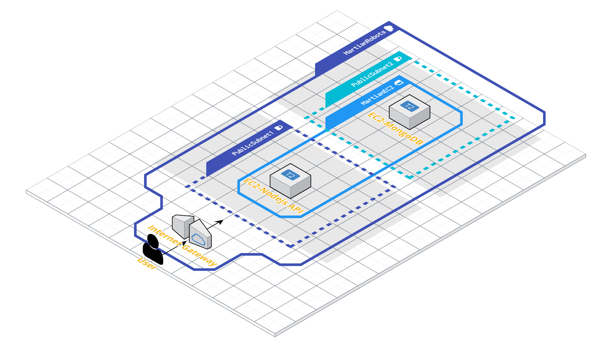

# Martian Robots 🪐

Este programa determina cada posición de los robots introducidos y su posición final.  
Se compone de dos partes principales:
## 1. Proceso de desarrollo

1. Especificación de requisitos y análisis.
2. Diseño de la arquitectura.
3. Aproximación de implementación con `Python` y CLI.
4. Migración a `Node.js`.
5. Implementación de la persistencia.
6. Desplegar REST API.
7. Contenerizar (`Docker`).
8. Deployment en nube (`AWS`).
9. Planteamiento de ejecución serverless.

## 2. Instrucciones para su ejecucion

*-------------------------------------------------------------------------*

### *1. Proceso de desarrollo* 🧰

#### 1. Especificación de requisitos y análisis
##### **Casos de Uso:**

| Caso de Uso | Descripción |
| ------------- | ------------- |
| **CU-1:** Introducir coordenada sup-dcha  | El usuario puede introducir las coordenadas iniciales del "mapa" |
| **CU-2:** Introducir posición robot | El usuario puede fijar la posición para el robot con el formato (int x int y, 'orientacion') |
| **CU-3:** Introducir instrucción robot | El usuario puede determinar la instrucción para el robot |
| **CU-4:** Consultar robots | El usuario puede consultar los robots del sistema |
| **CU-4-ext:** Consultar robots perdidos | El usuario puede consultar los robots marcados con la etiqueta "LOST" |

##### **Reglas de Negocio:**

- RU-1: La posición de un robot consiste en una coordenada en el mapa(formato: x, y) y una orientación(norte, sur, este, oeste).
- RU-2: La instrucción para un robot consiste en una cadena de caracteres formado por las letras: “L”,”R”, “F”.
- RU-3: El mapa es rectangular y delimitado, con la coordenada inf.izq fijada a '0, 0'.
- RU-4: Un robot que se mueve fuera de los límites es “perdido” para siempre.
- RU-5: La posición de “LOST” de un robot implica que el resto de robots ya no pueden ser perdidos en esa posición.
- RU-6: El valor máximo de cualquier coordenada es 50.
- RU-7: Cualquier instrucción será de menos de 100 caracteres de longitud.
- RU-8: El “output” estará compuesto por la posición final del robot y su orientación. Si el robot se pierde se imprimirá por pantalla la palabra “LOST”.
- RU-9: El sistema debe ser extensible para que, en el caso de implementaciones adicionales, su incorporación no resulte costosa.

##### Diagrama de análisis:
 
Siguiendo los casos de uso y las principales reglas de diseño se modela el diagrama de clases.  
  

   

#### 2. Diseño de la arquitectura
##### Diagrama de diseño:

Se elige una arquitectura con un modelo multicapa. En concreto, de tres capas:

- Interfaz
- Lógica o de negocio
- Persistencia

Además, se incluye un boceto de una implementación con AWS:
- Instancia `EC2` para el despliegue de la API REST con el servidor de `Node.js`.
- Instancia en `EC2` para el despliegue de la Base de Datos de `MongoDB`.

#### 3. Aproximación de implementación con `Python` y CLI.

Se realiza una implementación en python para contruir el esqueleto de la aplicación. Para su ejecución se hace uso de la interfaz de comandos de cualquier SO.  
En la sección de instrucciones se explica como [ejecutar](#2-instrucciones-para-su-ejecucion) esta aplicación.

#### 4. Migración a `Node.js`

La implementación realizada en python se pasa a JavaScript para ejecutarse en `Node.js`  
Se optimiza el diseño para adaptarse. Aspectos y características de Python tienen que ser "rediseñadas" para poder implementarse con JavaScript.  
Además, se escriben tests con Jest para comprobar el correcto funcionamiento.

#### 5. Implementación de la persistencia.

La persistencia se implementa mediante el uso de base de datos No-SQL orientada a documentos. En concreto, con MongoDB.

  
  
La BD es muy sencilla. Tan solo es necesaria una colección, donde se almacenan:
- Id del robot (generado en tiempo de ejecución con uuid).
- La posición (formada por los mismos parámetros que el código).
- Un valor booleano que determina si el robot se ha perdido.
- El set de instrucciones asociado a ese robot.

#### 6. Desplegar API REST.

Con el objetivo de proveer una mayor interfaz de acceso y visualización de los datos, se implementa una API. Sin embargo, está en fase inicial; y solo permite la consulta de los robots existentes y los que están perdidos. El funcionamiento es explicado en la [sección](#2-instrucciones-para-su-ejecucion) de instrucciones de ejecución.  
Para crear una API de forma rápida se hace uso del framework `express`.  
Se implementan dos rutas:
- GET /robots --> devuelve todos los robots en la BD.
- GET /robots/lost --> devuelve los robots perdidos. 